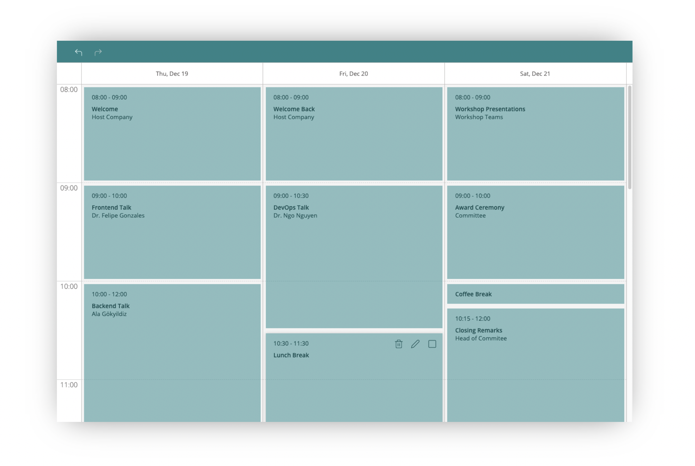

> "It's not a calendar. It's a component to build an event's agenda."

 

  
  

[Documentation](https://schachdavid.github.io/react-event-agenda-doc/)

[Demo](https://schachdavid.github.io/react-event-agenda-doc/)

## Development

## License

MIT © 

